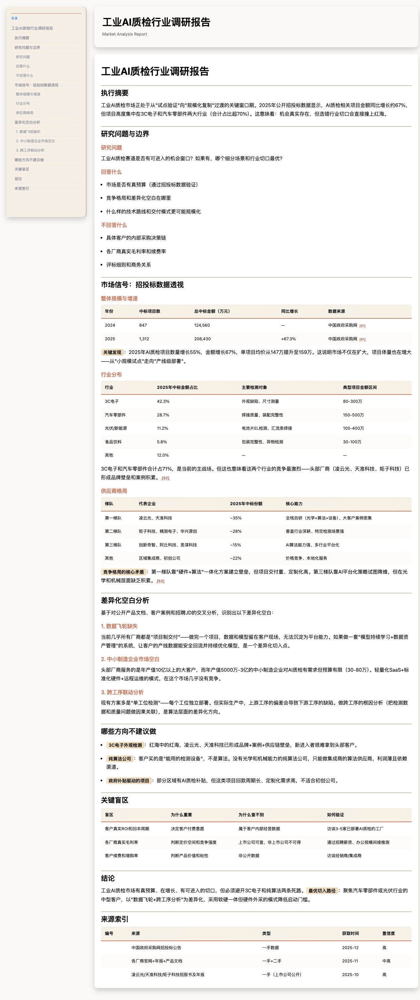

# Market Research — AI Agent Skill

> Research is not template filling. Research is **decision support from available evidence**.

[](LICENSE)
[](https://hermes-agent.nousresearch.com)

[中文版](README.md)

---

## What is this?

A **market research skill for AI agents** — not a prompt template, but a complete research methodology that teaches AI agents to work like professional analysts.

When you give an AI a vague request like "research if there's opportunity in industrial AI inspection", this skill guides it through a rigorous, evidence-first workflow instead of generating a generic, unsourced report.

## Core Philosophy: Evidence-First, Not Template-First

The problem with most AI research: **it starts writing before knowing what evidence exists**. The result is a report that looks complete but contains nothing you can act on.

This skill enforces a different order:

```
Vague request → Calibrate the decision → Scout evidence → Choose research path
    → Deepen high-value channels → Write report → Fact-check → Deliver
```

Every step has a quality gate. If evidence is thin, the skill produces a validation plan instead of a fake report.

### 5 Key Principles

1. **No calibration, no research**: Rewrite the user's vague question into a researchable decision question before searching
2. **Evidence map first**: Rate every direction by evidence density and quality; drop low-density directions
3. **Label confidence**: Every claim is tagged as Fact / Inference / Judgment / Recommendation
4. **Blind spots > fake data**: When public sources can't answer something, document it as a blind spot with a validation path
5. **Adaptive structure**: If evidence supports 4 chapters, write 4 — don't force 11 from a template

## What It Produces

| Artifact | Description |
|---|---|
| Calibrated research question | The original vague request rewritten into something researchable |
| Evidence map | A table of search directions with density, quality, and go/no-go decisions |
| Markdown report | Formal consulting / equity research style, not blog-post tone |
| HTML report | Dark theme + glassmorphism + sticky sidebar TOC + clickable citations |
| Source index | Every key claim linked to a source with retrieval date and confidence |
| Blind spot list | Decision-critical variables that public sources can't answer, with validation paths |

### HTML Report Preview

Dark gradient background + glassmorphism cards + sticky left sidebar TOC + gradient headings + scroll animations.



→ See `references/report-template-dark.html` for the template.

## File Structure

```
market-research/
├── README.md              # Chinese readme (primary)
├── README_EN.md           # This file
├── SKILL.md               # Main skill file (AI agent system prompt)
├── LICENSE                # MIT
├── references/
│   ├── evidence-workflow.md    # Question calibration + evidence scouting
│   ├── methods.md              # Analysis lenses (DBS, Superpowers, Lenny, CAICT)
│   ├── reporting.md            # Report writing rules + HTML generation
│   ├── structure-patterns.md   # Report patterns from Cir.cn, Chinabgao, CAICT
│   ├── quality.md              # Quality gates + confidence scoring + fact-checking
│   ├── sales-visit-prep.md    # 🆕 Sales visit prep: search strategies, topics, talk tracks
│   └── report-template-dark.html # HTML report template
├── assets/
│   └── report-preview.png     # HTML report screenshot
├── scripts/
│   ├── render_html.py      # Markdown → HTML renderer
│   ├── validate_skill.py   # Static structure validator
│   └── run_evals.py        # Eval case runner
└── evals/
    └── evals.json          # 7 eval cases with assertions
```

## Quick Start

### Prerequisites

1. Install [Hermes Agent](https://hermes-agent.nousresearch.com)
2. Clone this repo into Hermes' skills directory:

```bash
git clone https://github.com/yzmw123/market-research.git \
  ~/.hermes/skills/research/market-research
```

3. In a Hermes conversation, the skill auto-loads when you make a research request. You can also trigger it manually:

```
Research the competitive landscape for AI code editors
Help me analyze the procurement patterns in government IT
Is there an opportunity in industrial predictive maintenance?

# Sales visit preparation
I'm visiting a client in the power industry tomorrow, help me prepare
Find some talking points for my meeting with an energy group executive
What's happening in the manufacturing sector lately? I have client meetings next week
```

### Verify Installation

```bash
cd ~/.hermes/skills/research/market-research
python3 scripts/validate_skill.py
# Output: PASS: market-research skill structure looks good
```

### Run Evals

```bash
# List all eval cases
python3 scripts/run_evals.py

# Run a single case
python3 scripts/run_evals.py --run 1

# Run all (requires hermes CLI)
python3 scripts/run_evals.py --run all
```

## Eval Cases

7 eval cases cover the most common failure modes:

| # | Case | What it tests |
|---|---|---|
| 1 | Vague opportunity request | Doesn't jump to writing; calibrates first |
| 2 | ToG private-info trap | Doesn't fake knowledge of internal scoring |
| 3 | AI IDE competitor research | Includes status-quo alternatives, not just feature tables |
| 4 | Consumer metrics trap | Doesn't fabricate CAC/LTV/retention curves |
| 5 | Thin public evidence | Recognizes limits, outputs validation plan |
| 6 | Paid report TOC reference | Uses TOCs as structure reference, not fact evidence |
| 7 | CAICT authoritative report | Leverages institutional framework, verifies critical numbers |

## Supported Research Scenarios

- **Market entry judgment**: Is there real budget? Replicable delivery path? Unmonopolized segments?
- **Product/direction selection**: Which niche? Whose market share can we take?
- **Competitor teardown**: Capability boundaries, pricing logic, user alternatives
- **Procurement intelligence**: Tender categories, award patterns, supplier ecosystem
- **Company diligence**: Equity, operations, legal, industry position from public sources
- 🆕 **Sales visit preparation**: Scout industry news, policies, tenders, and case studies before a client meeting; generate conversation topics and sales talking points

## Research Boundaries (What This Skill Won't Do)

| Domain | Public sources can reveal | Public sources CANNOT reveal |
|---|---|---|
| ToG | Policies, procurement intentions, tender awards, supplier patterns | Internal scoring, expert relationships, dark prices |
| ToB | Positioning, pricing, docs, cases, hiring signals | Internal procurement process, true ROI, churn, renewal rate |
| ToC | App reviews, social media, rankings, public ads | True CAC/LTV, retention curves, algorithm weights, A/B results |

When a requested dimension is structurally unavailable from public sources, the skill says so early and proposes a validation route instead of padding with "data unavailable."

## Why This Exists

I'm a product manager who regularly needs to research industries, competitors, and market opportunities. The problem with asking ChatGPT/Claude directly:

- Output reads like AI summary, not a professional report
- Numbers have no sources — impossible to verify
- Every research session requires re-teaching the AI how to work
- Report tone sounds like a blog post, not consulting-grade analysis

Over several months, I codified my research methodology into this reusable AI skill. It's produced dozens of research reports for my work. If you also need AI to help with market research, take it and use it.

## License

MIT — see [LICENSE](LICENSE).
